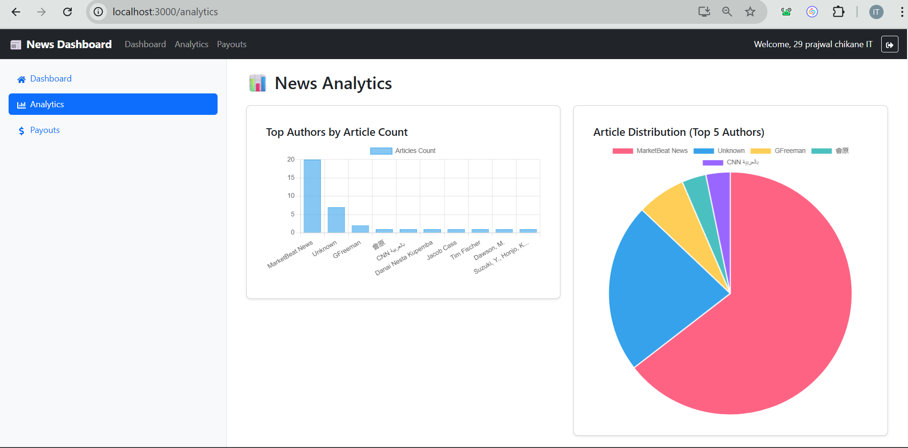

# News Dashboard

A responsive React dashboard that allows users to log in and view news articles from a third-party API. Only the admin can access advanced features like Analytics and Payouts.

## Features

- **Google Authentication** (Firebase)
- **Dashboard**: All users can view news articles, filter by author/date, and search.
- **Admin Features**: Only the admin can access Analytics (charts) and Payout Calculator.
- **Responsive Design**: Works on mobile and desktop.
- **Export**: Admin can export payout reports as PDF or CSV.

## Admin Access

- **Admin Email:** `prajwalchikane0@gmail.com`
- Only this email can access the Analytics and Payouts sections.
- All other users can log in and view the dashboard but cannot use admin features.

## Available Scripts

In the project directory, you can run:
## Screenshots

### Login Page

### Dashboard

### Analytics (Admin Only)

### Payout (Admin Only)

### `npm start`

Runs the app in the development mode.\
Open [http://localhost:3000](http://localhost:3000) to view it in your browser.

